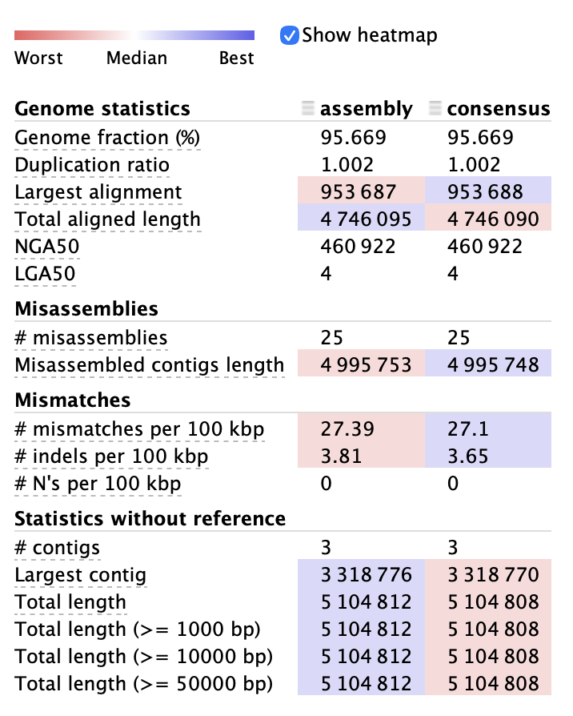
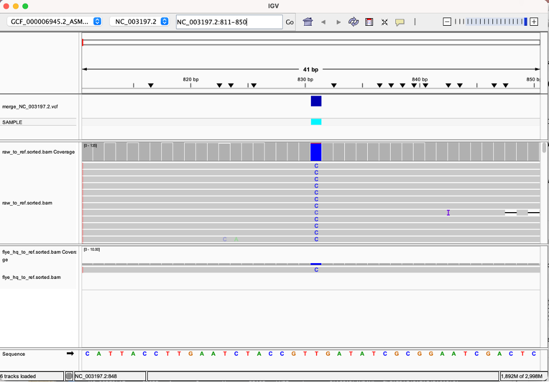
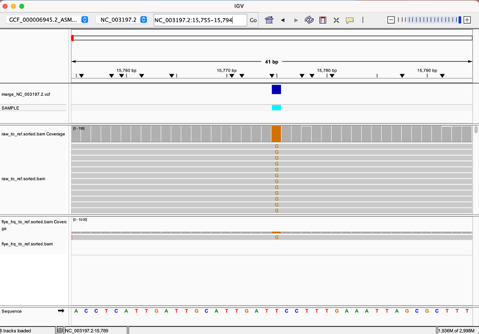
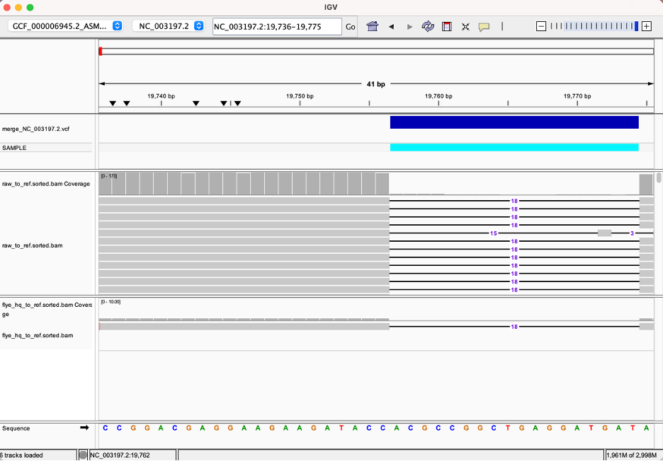

# Genome Assembly of *Salmonella enterica*

## Introduction

Genome assembly is an important step in bioinformatics. It helps in reconstructing the genome of an organism from raw sequencing reads. In bacterial species such as *Salmonella enterica*, an accurate genome assembly is needed to study genome organization and to identify genetic differences between different isolates. This information is useful for downstream biological interpretation such as comparison between strains and outbreak related studies [1].

Even though bacterial genomes are smaller in size when compared to eukaryotic genomes, assembling them correctly is not easy. Repetitive regions, structural variation and sequencing errors can affect the reconstruction of a correct consensus genome [2].

Short-read sequencing technologies are commonly used for bacterial genome sequencing as they provide high base level accuracy. However, assemblies generated using short reads are often fragmented. This is mainly because short sequencing reads are not long enough to span repetitive regions or more complex genomic structures that are commonly present in bacterial genomes. When these regions are not spanned properly, the genome breaks into multiple contigs. As a result, certain regions of the genome such as plasmids or repeat rich regions may not be resolved correctly [3].

Long-read sequencing technologies such as Oxford Nanopore sequencing help reduce some of these issues. Since the reads are much longer, repetitive regions and larger structural variants can be spanned more easily, which often results in assemblies that are less fragmented and more complete [2].

At the same time, long-read sequencing also has its own limitations. Oxford Nanopore reads generally show higher per-read error rates compared to short reads, with insertion and deletion errors being commonly observed in homopolymer regions. These errors can affect base level accuracy in the final assembly if they are not taken into account during analysis [4].

Recent improvements in Oxford Nanopore sequencing, particularly advances in neural network basecalling models, have improved read accuracy for bacterial genomes [8]. This has made long-read-based genome assembly more practical for bacterial genomes. Even so, long-read assemblies may still contain residual errors. Hence, different genome assembly approaches involve considerations of contiguity, completeness and correctness. The assembly quality cannot be assessed using contiguity metrics alone [5].

## Proposed Methods

Oxford Nanopore R10 sequencing reads in FASTQ format will be used for this genome assembly. Before starting the assembly, the sequencing data will be checked to understand what it looks like. This includes looking at the read length distribution and the general sequencing quality. This step is important because Nanopore sequencing is known to have specific error patterns and these need to be considered before assembly [4].

Genome assembly will be done using Flye. Flye is a long-read assembler that is commonly used for bacterial genomes. It is suitable for this dataset because it is able to deal with repetitive regions and structural complexity, which are often present in bacterial genomes. Since the reads are long and error prone, a repeat graph–based assembler such as Flye is an appropriate choice [2].

After the assembly is generated, the assembled genome will be compared with a reference *Salmonella enterica* genome obtained from NCBI. The comparison will be done by aligning the assembly to the reference using minimap2. The alignment output will then be sorted and indexed using samtools so that it can be examined further. Visual inspection of the alignment will be carried out using IGV to look for structural variation and possible assembly related issues [7].Following alignment to the reference genome, variant calling will be performed to identify sequence level differences between the assembled genome and the reference. Single nucleotide variants and small insertions and deletions will be identified using Clair3, a variant caller designed for long-read sequencing data, including Oxford Nanopore reads [9]. The identified variants will be used to assess base level accuracy and to further characterize differences between the assembled genome and the reference strain.

### Pipeline parameters

Genome assembly will be performed using Flye with the `--nano-hq` preset, which is optimized for high accuracy Oxford Nanopore R10 reads. The final assembly will be aligned to a reference *Salmonella enterica* genome obtained from NCBI using minimap2 with an assembly alignment preset (`-ax asm`). Alignment files will be sorted and indexed using samtools, and visually inspected in IGV to assess large-scale structural consistency and potential assembly related issues.

For variant detection, raw Oxford Nanopore reads will be aligned directly to the reference genome using minimap2 with the `-ax map-ont` preset. Variant calling will be performed using Clair3 to identify single nucleotide variants and small insertions and deletions relative to the reference genome.

## Results
### Assembly

The genome assembly was generated from Oxford Nanopore reads using Flye `--nano-hq` and compared to the *S. enterica* reference genome (GCF_000006945.2_ASM694v2) using QUAST (Fig. 1). The Flye HQ assembly consisted of **3 contigs**, with a total length of **5,104,812 bp** and a largest contig of **3,318,776 bp**. QUAST reported a genome fraction of **95.669%** and a duplication ratio of **1.002**, indicating strong overall agreement with the reference. The assembly contained **25 misassemblies**, with **27.39 mismatches per 100 kbp** and **3.81 indels per 100 kbp**.

For comparison, an exploratory baseline Flye `--nano-raw` assembly was more fragmented (**9 contigs**; largest contig **1,576,260 bp**), while the overall genome fraction remained similar (**95.391%**). Medaka polishing of the Flye HQ assembly produced minimal changes in QUAST summary metrics (genome fraction remained **95.669%**, contigs remained **3**), so the Flye HQ assembly was used as the primary assembly for downstream alignment inspection.

**Figure 1.** QUAST summary comparing the Flye HQ assembly (assembly) and Medaka-polished consensus (consensus) against the *S. enterica* reference genome. Polishing resulted in minimal changes to contiguity and error metrics.

### Variant Visualization (IGV)

Representative SNPs and indels were visually inspected in IGV to validate variant calls. Raw Oxford Nanopore read alignments and the Flye HQ assembly were examined against the S. enterica reference genome to assess read support and consistency.

Three representative sites on the main chromosome (NC_003197.2) were selected: **831 (SNP)**, **15775 (SNP)** and **19756 (indel)**. At each locus, the alternate allele was consistently supported across multiple reads and the observed pattern in the read pileup matched the variant reported by Clair3 (Fig. 2–4), indicating true sequence variation.

**Figure 2.** IGV view of a SNP at NC_003197.2:831 located within thrA (STM0002), supported by consistent base substitution across raw reads and the Flye HQ assembly.

**Figure 3.** IGV visualization of a SNP at NC_003197.2:15775 located within STM0014 (putative LysR-type transcriptional regulator).

**Figure 4.** IGV visualization of an indel at NC_003197.2:19756 located within STM0018 (putative exochitinase)

This indel results in a length change relative to the reference sequence. If this is located within a coding region, it could cause a frameshift mutation and potentially alter downstream amino acid sequence and gene function.

## Discussion

The assembled **Salmonella enterica** genome showed strong agreement with the reference, with a genome fraction of **~95.7%** and a low duplication ratio. The final assembly consisted of **three contigs**, indicating high contiguity achieved using Oxford Nanopore long-read sequencing. QUAST-reported misassemblies reflect structural differences relative to the reference genome rather than assembly errors[2,5].

Base-level comparison to the reference genome identified thousands of variants, including SNPs and small indels. The primary chromosome **(NC_003197.2)** contained fewer variants than the secondary replicon **(NC_003277.2)**, in our dataset, suggesting greater sequence divergence relative to the reference at this replicon in the present dataset.

Visual inspection in **Integrative Genomics Viewer (IGV)** supported the reliability of the variant calls. Representative SNPs and an indel showed consistent support across raw Oxford Nanopore reads and the Flye HQ assembly. This concordance between read-level evidence and assembly alignment suggests that the detected variants represent true sequence differences rather than potential mapping errors.

From a biological perspective, SNPs within coding regions may be synonymous or nonsynonymous. Nonsynonymous substitutions within coding regions may alter amino acid sequence and potentially influence protein structure or function[10]. 

Overall, this analysis demonstrates that combining long-read assembly, read-based variant calling and IGV visualization provides a robust framework for genome comparison. Integrating structural metrics with base level validation allows for more confident interpretation of genomic differences relative to a reference genome.

### Variant to Gene Mapping Using Reference Annotation

To provide functional context, representative variants were mapped to genes using the RefSeq annotation (GCF_000006945.2; GFF file from NCBI).

- **NC_003197.2:831 (SNP)** occurs within *thrA* (STM0002), encoding aspartokinase I (threonine biosynthesis).
- **NC_003197.2:15775 (SNP)** lies within *STM0014*, annotated as a LysR-type transcriptional regulator. LysR-family regulators control virulence-associated gene networks in *Salmonella*, including SPI-1 pathways [11].
- **NC_003197.2:19756 (indel)** lies within *STM0018*, annotated as a putative exochitinase based on homology based gene prediction.

Because these variants fall within coding sequences, SNPs may be synonymous or nonsynonymous. Indels could introduce a frameshift, potentially altering the encoded protein.

## References

[1] Wick RR, Judd LM, Holt KE. *Assembling the perfect bacterial genome using Oxford Nanopore and Illumina sequencing*. PLOS Computational Biology, 2023.\
[2] Kolmogorov M, Yuan J, Lin Y, Pevzner PA. *Assembly of long, error-prone reads using repeat graphs*. Nature Biotechnology, 2019.\
[3] Liao Y et al. *Completing bacterial genome assemblies: strategy and performance comparisons*. Scientific Reports, 2015.\
[4] Delahaye C, Nicolas J. *Sequencing DNA with nanopores: Troubles and biases*. Bioinformatics, 2021.\
[5] Thrash A, Hoffmann F, Perkins A. *Toward a more holistic method of genome assembly assessment*. BMC Bioinformatics, 2020.\
[6] Li H. *Minimap2: pairwise alignment for nucleotide sequences*. Bioinformatics, 2018.\
[7] Thorvaldsdóttir H, Robinson JT, Mesirov JP. *Integrative Genomics Viewer (IGV): high-performance genomics data visualization*. Bioinformatics, 2013.\
[8] Wick RR, Judd LM, Holt KE. Performance of neural network basecalling tools for Oxford Nanopore sequencing. Genome Biology, 2019.      [9] Zheng Z, Li S, Su J, et al. Symphonizing pileup and full-alignment for deep learning–based long-read variant calling. Nature Computational Science, 2022.     
[10] Hu L, Cao G, Brown EW, Allard MW, Ma LM, Zhang G. Whole genome sequencing and protein structure analyses of target genes for the detection of Salmonella. Scientific Reports.2021.   
[11] Martínez-Flores I, Pérez-Morales D, Sánchez-Pérez M, et al. *In silico clustering of Salmonella global gene expression data reveals novel genes co-regulated with the SPI-1 virulence genes through HilD*. Scientific Reports, 2016.
